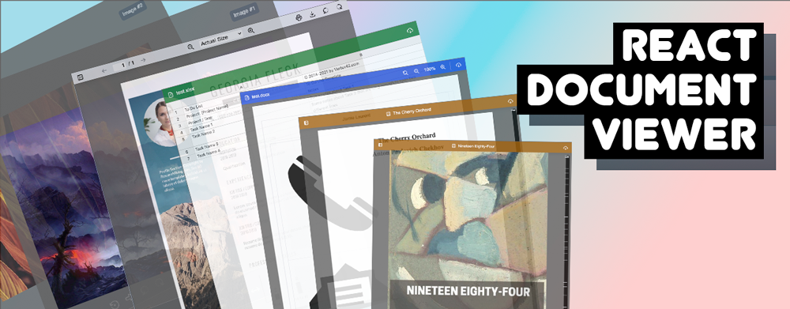

### + INTRO

Accepted document formats:

- docx
- xls, xlsx
- pdf
- epub
- fb2
- mobi
- all images

See: [index.js](./src/index.js) for more details.

Locales available:

- en-US, es-ES, ru-RU, zh-CN

See [i18next](https://www.i18next.com/overview/configuration-options) for configuration options.

### + CREDITS

- E-book viewer based on [johnfactotum's Foliate-js](https://github.com/johnfactotum/foliate-js)
- Image viewer is inspired by [fengyuanchen's Viewerjs](https://github.com/fengyuanchen/viewerjs)